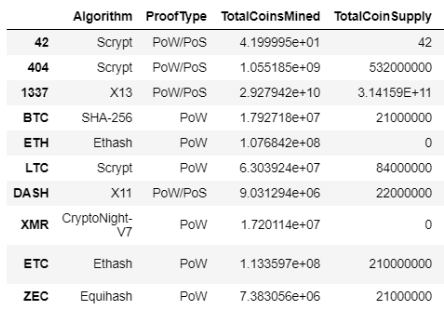
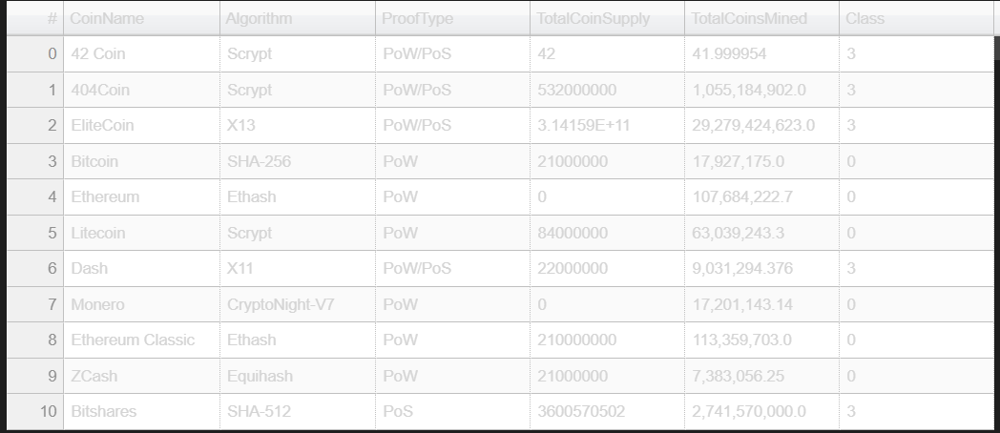

# Cryptocurrencies
Module 18: Unsupervised Machine Learning and Cryptocurrencies

## Project Overview
This project involves the use of unsupervised machine learning to use on a cryptocurrencies dataset. Here, we create an analysis of the current cryptocurrency market - a report that includes what cryptocurrencies are on the trading market and how they could be grouped to create a classification system.

## Resources
- Data Source: crypto_data.csv
- Software: Jupyter Notebook,  Python

### Deliverables
- Deliverable 1: Preprocessing the Data for PCA
- Deliverable 2: Reducing Data Dimensions Using PCA
- Deliverable 3: Clustering Cryptocurrencies Using K-means
- Deliverable 4: Visualizing Cryptocurrencies Results

### Deliverable 1: Preprocessing the Data for PCA
For Deliverable 1, the data was preprocessed for PCA. The cryptocurrencies that were being traded were kept, dropped the 'IsTrading' column, filter through the data so it only keeps coins that have been mined, and remove CoinName from the Dataframe. 
The screenshot belows shows the data after all these steps have been completed.

### Deliverable 2: Reducing Data Dimensions Using PCA
Deliverable 2 is reducing data dimensions using PCA. A PCA algorithm is used and a new Dataframe is created to include columns PC 1, PC 2, and PC 3, while using an index. The output is shown below. 

### Deliverable 3: Clustering Cryptocurrencies Using K-means
In Deliverable 3 an elbow curve is created using the hvPlot to find the best value for K. Below is the output.

Elbow curve:

### Deliverable 4: Visualizing Cryptocurrencies Results

Below is a 3D-Scatter with the PCA data. 

Below is a table with the tradeable cryptocurrencies.

Total Coins Supply vs Total Coins Mined Scatter Plot:

