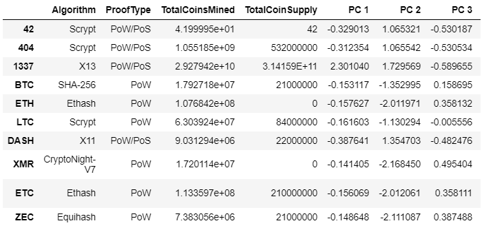
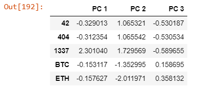
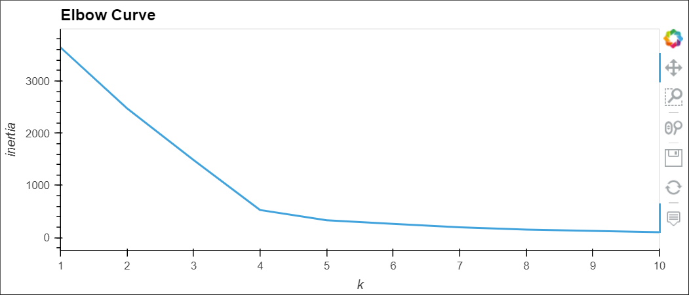
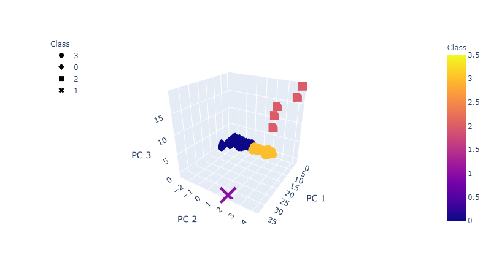
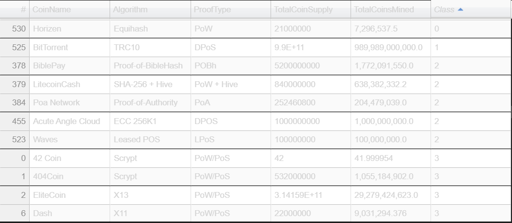
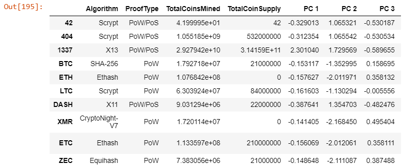
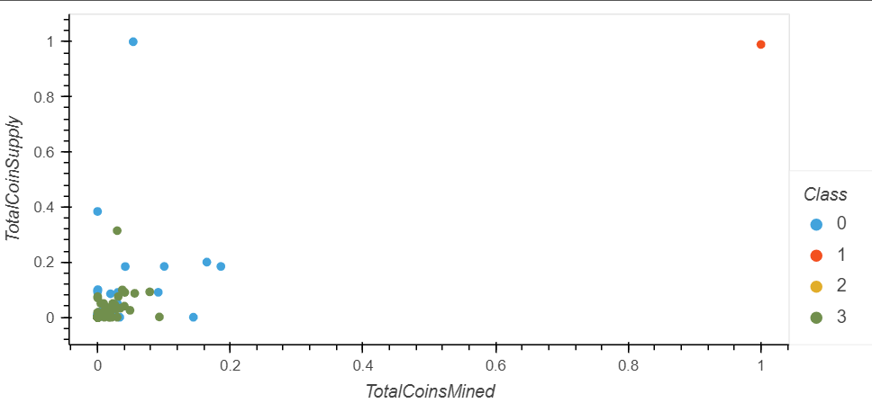

# Cryptocurrencies
Module 18: Unsupervised Machine Learning and Cryptocurrencies

## Project Overview
This project involves the use of 

## Resources
- Data Source:
- Software: Jupyter Notebook,  Python

### Deliverables
- Deliverable 1: Preprocessing the Data for PCA
- Deliverable 2: Reducing Data Dimensions Using PCA
- Deliverable 3: Clustering Cryptocurrencies Using K-means
- Deliverable 4: Visualizing Cryptocurrencies Results

### Deliverable 1: Preprocessing the Data for PCA
For Deliverable 1, the data was preprocessed for PCA. The cryptocurrencies that were being traded were kept, dropped the 'IsTrading' column, filter through the data so it only keeps coins that have been mined, and remove CoinName from the Dataframe. 
The screenshot belows shows the data after all these steps have been completed.

### Deliverable 2: Reducing Data Dimensions Using PCA
Reducing data to get data frame below?

### Deliverable 3: Clustering Cryptocurrencies Using K-means
Elbow curve:

Clusters plotted in 3D dataframe:

Cryptocurrencies dataframe:

Clustered dataframe below:

### Deliverable 4: Visualizing Cryptocurrencies Results
Total Coins Supply vs Total Coins Mined:

